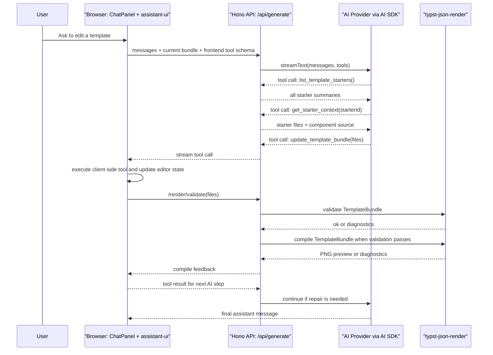

# DeepPrint TS Restart Plan V1

This document resets DeepPrint TS around one product path:

> DeepPrint edits TemplateBundle files with AI. typst-json-render renders those bundles to PNG/PDF.

## 1. Scope

DeepPrint TS becomes the product layer:

- UI and workspace
- auth and users
- template/project management
- AI chat and thin workflow
- database state
- calls to the render service

`typst-json-render` becomes the render layer:

- validate TemplateBundle files
- validate `data.json` against `data.schema.json`
- compile Typst
- return PNG preview by default
- return PDF when requested
- own file/path/package safety around rendering

MCP is not the main product runtime. It can stay useful for local debugging, but the web product should call the Rust render HTTP API directly.

## 2. First Version

Build only the base loop:

1. User creates or opens a template.
2. AI edits a TemplateBundle.
3. DeepPrint stores the draft bundle.
4. DeepPrint asks `typst-json-render` to validate/compile it.
5. The page displays the returned PNG preview.
6. User saves the result.

Do not build self-upgrading memory, template sharing, marketplace, promotion, or component mining in V1.

Template Memory 已经从 `typst-json-render` 边界迁移到 DeepPrint 产品层设计。后续实现见 [DeepPrint Template Memory V1](./template-memory-v1.md)。

组件库也放在 DeepPrint 产品层，但只作为生成素材。最终用户模板保持自包含，不要求携带 `lib/` 目录。详见 [Template Component Inline V1](./template-component-inline-v1.md)。

## 3. Template Storage

Stop treating a template as only `typst_code + mock_data`.

Store a TemplateBundle file map:

```json
{
  "template.typ": "...",
  "data.schema.json": "{...}",
  "data.json": "{...}"
}
```

For V1, keep this as one `jsonb` column such as `files_json`. Split it into separate tables only when queries or collaboration features require that.

Minimum template states:

- `draft`
- `previewed`
- `saved`

Skip `accepted`, `memory`, and `promotion` until the basic product loop is good.

## 4. AI Workflow

Use AI SDK plus a small handwritten workflow.

Keep the workflow boring:

- build system prompt
- provide current bundle files
- expose starter directory/context tools before editing a new template
- expose a few small AI SDK tools instead of a framework-scale tool set
- define the tool once in the browser with assistant-ui `defineToolkit`
- forward that tool schema through `AssistantChatTransport`
- convert forwarded frontend tools on the server with `frontendTools(...)`
- execute the mutation tool in the browser because it mutates editor UI state
- call Rust validate/compile
- return errors or preview to the UI

### 4.1 Tool Boundary

DeepPrint product runtime does not use MCP as the main in-app path.

The actual layering is:

```text
AI SDK tool call
-> DeepPrint server/browser handler
-> typst-json-render HTTP API
```

So when this document says "tool", it means an AI SDK tool exposed by DeepPrint to the model. `typst-json-render` stays behind DeepPrint as a render service.

### 4.2 Existing Tools And Capabilities

Already present in the current product loop:

- `update_template_bundle`
  - model-visible tool
  - applies TemplateBundle file changes to the editor/workspace
  - triggers validate/compile as part of tool execution
  - returns actual execution steps and compile result back into the stream
- `POST /api/render/validate`
  - backend capability, not directly exposed to the model
  - wraps `typst-json-render` validation
- `POST /api/render/compile`
  - backend capability, not directly exposed to the model
  - wraps `typst-json-render` compile and returns PNG by default

Keep `update_template_bundle` as the only mutation tool in V1. Do not give the model separate "save file", "write schema", "write template", and "compile" tools; that just creates more chances to drift.

### 4.3 Tools Needed For Starter + Component Flow

To support the new "thin starter + internal component source + inline final template" path, expose two read tools:

- `list_template_starters()`
  - model-visible tool
  - returns all starter summaries
  - returns no file source
  - used as the starter directory before creating a new template
- `get_starter_context(starterId)`
  - model-visible tool
  - returns one starter's `manifest.json`, `template.typ`, `data.json`, and `data.schema.json`
  - also returns the matching internal domain component source file, such as `receipt-v1.typ`
  - used after the model picks one anchor starter

Do not split `get_starter_context` into separate starter/component read tools in V1. The model should not have to remember an extra component lookup step.

For an existing template, the model can edit the current bundle directly. It only needs `list_template_starters()` and `get_starter_context(starterId)` when the current bundle is empty, clearly wrong for the request, or the user asks to switch template type.

The model should follow three hard rules:

1. Call `list_template_starters()` before creating a new template or switching template type.
2. Choose exactly 1 starter as the anchor.
3. Call `get_starter_context(starterId)` for that starter.
4. Use the provided starter as the base layout and the provided component source as the primary domain reference.
5. Only write new Typst when the starter and component source do not cover the required layout.
6. When writing new Typst, keep it minimal and consistent with the provided style.

This avoids the usual "template stitching" mess.

### 4.4 Tool Contract Shape

`list_template_starters()` returns every starter summary, but no source code:

```json
[
  {
    "starterId": "receipt-basic",
    "title": "58mm receipt basic",
    "documentType": "receipt",
    "summary": "Single-page narrow thermal receipt starter.",
    "whenToUse": ["order receipt", "takeaway receipt", "cashier ticket"],
    "avoidFor": ["invitation", "a4 document", "exam paper"]
  }
]
```

`get_starter_context(starterId)` returns:

```json
{
  "starter": {
    "starterId": "receipt-basic",
    "documentType": "receipt",
    "files": {
      "manifest.json": "...",
      "template.typ": "...",
      "data.json": "...",
      "data.schema.json": "..."
    }
  },
  "componentSource": {
    "componentId": "receipt-v1",
    "documentType": "receipt",
    "source": "..."
  }
}
```

### 4.5 Flow



Prompt rule for the model:

```text
Use the provided starter as the base layout.
Use the provided component source as the primary reference for domain-specific layout and helpers.
Prefer adapting or inlining existing starter/component patterns instead of inventing new Typst structure.
Only write new Typst from scratch when the starter and component source do not cover the required layout.
When writing new Typst, keep it minimal and consistent with the existing starter/component style.
```

Do not add Flue, Mastra, LangGraph, or a custom agent framework in V1. Add one only after this direct workflow becomes hard to maintain.

## 5. Provider Policy

Use AI SDK as the provider layer.

V1 providers:

- Google Gemini via `@ai-sdk/google`
- OpenAI via `@ai-sdk/openai`
- OpenAI-compatible APIs via `createOpenAI({ baseURL, apiKey })`

Remove fake provider branches. For example, do not list Anthropic until `@ai-sdk/anthropic` is actually installed and wired.

Avoid a custom provider registry in V1. A tiny resolver that converts user/server config into an AI SDK model is enough.

## 6. User Keys

Replace the current awkward user-key path with one standard config shape.

Supported modes:

- platform key from server env
- user key from request

Both modes must resolve to the same AI SDK model interface before entering the workflow.

Do not store user keys in the database in V1. If user keys are supported, keep them browser-local and send them only for the current request.

## 7. Rendering

Remove browser-side Typst compilation from the product path.

The frontend should not compile Typst. It displays artifacts returned by the backend/render service.

The backend calls `typst-json-render`:

- `POST /validate`
- `POST /compile`

Compile defaults:

- output format: `png`
- PDF requested explicitly
- errors returned with enough line/column context for AI repair

## 8. Deployment

Move away from Cloudflare Pages Functions and D1.

Use Docker Compose:

- `web`: DeepPrint TS app/backend
- `db`: PostgreSQL

Do not preserve Cloudflare compatibility while rewriting this path. It adds cost without helping the new architecture.

Current migration note: `docker-compose.yml` runs only the Node/Hono web container and PostgreSQL. Run `typst-json-render` separately on `localhost:8000`; `TJR_RENDER_BASE_URL` points to `host.docker.internal:8000` from Docker.

## 9. Database

Replace D1 assumptions with PostgreSQL.

V1 can stay simple:

- users
- folders/projects
- templates
- template_versions
- ai_threads
- ai_messages

Add `files_json jsonb` to templates and versions.

Artifacts are owned by `typst-json-render`. DeepPrint stores the TemplateBundle and displays returned PNG/PDF artifacts.

## 10. What To Delete Or Replace

Replace:

- `update_typst` tool with `update_template_bundle`
- `typst_code + mock_data` runtime path with TemplateBundle files
- Typst Web Compiler preview with Rust render previews
- D1 migrations with PostgreSQL migrations
- Wrangler runtime with a Node server runtime

Deleted in the restart path:

- Cloudflare-only glue
- D1-only Kysely adapter
- browser Typst compiler dependencies
- fake Anthropic provider branch

## 11. Development Order

1. Add TemplateBundle types in TS.
2. Add PostgreSQL schema for `files_json`.
3. Add Rust render client.
4. Add backend validate/compile endpoints.
5. Replace preview UI to load PNG from backend.
6. Replace AI tool with `update_template_bundle`.
7. Keep removing leftover Cloudflare/D1/browser-compiler references when they appear.

Keep each step runnable. Delete old code only after the replacement is live.
