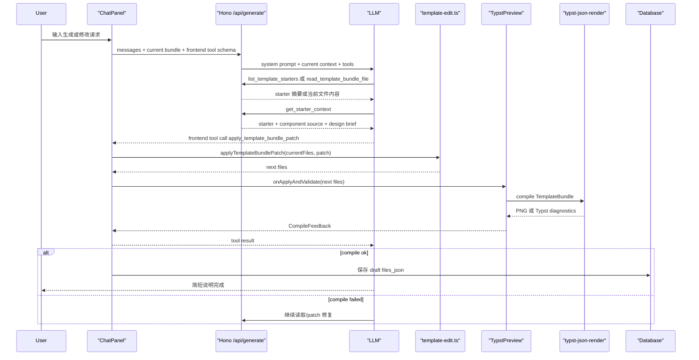

# DeepPrint Template Agent Workflow V1

这份文档用来学习当前 DeepPrint 模板生成 Agent 的真实链路。它不是产品 PRD，而是一张读代码地图：从用户在聊天框输入一句话，到模型选择 starter、生成 patch、浏览器应用修改、调用 Typst 编译、预览刷新、保存到数据库。

## 1. 一句话概览

当前 Agent 的核心循环是：

```text
User message
-> ChatPanel 组装当前 TemplateBundle
-> /api/generate 注入 system prompt、starter/design brief、工具 schema
-> LLM 读取 starter 或当前文件
-> LLM 调用 apply_template_bundle_patch
-> Browser 应用 patch 到 TemplateBundle
-> App 调用 typst-json-render 编译
-> 成功后刷新预览并保存草稿
-> 失败时把错误回传给 LLM 继续修
```

这里最重要的产品判断是：模型不直接“保存文件”，也不直接调用渲染服务。模型只通过 DeepPrint 暴露的工具读当前模板、打 patch。真正的编辑状态、编译和保存由浏览器与后端掌控。

## 2. 读代码路线

建议按这个顺序读：

1. [src/components/ChatPanel.tsx](/Users/cola/Projects/deepprint-ts/src/components/ChatPanel.tsx:354)

   看 `ChatPanel` 组件本体。这里维护聊天运行时、当前工作区快照、前端工具定义。

2. [functions/api/[[route]].ts](/Users/cola/Projects/deepprint-ts/functions/api/[[route]].ts:76)

   看 `TYPST_SYSTEM_PROMPT`。这是模型行为边界：什么时候读文件、什么时候 patch、什么时候必须继续修。

3. [functions/api/[[route]].ts](/Users/cola/Projects/deepprint-ts/functions/api/[[route]].ts:617)

   看 `/generate`。这里把前端工具 schema、starter 工具、当前上下文、design brief 一起交给模型。

4. [src/lib/template-edit.ts](/Users/cola/Projects/deepprint-ts/src/lib/template-edit.ts:128)

   看 patch parser。这里决定模型输出的补丁文本怎样变成 TemplateBundle 文件变更。

5. [src/App.tsx](/Users/cola/Projects/deepprint-ts/src/App.tsx:391)

   看 `handleApplyAndValidateFromAi`。这是 AI 修改真正进入编辑器、编译预览、保存草稿的地方。

6. [src/components/TypstPreview.tsx](/Users/cola/Projects/deepprint-ts/src/components/TypstPreview.tsx:55)

   看 `compileAndGetError`。这是前端请求 Typst 编译并更新 PNG 预览的位置。

## 3. 文件职责

[src/components/ChatPanel.tsx](/Users/cola/Projects/deepprint-ts/src/components/ChatPanel.tsx:31)

聊天面板是浏览器侧 Agent loop 的核心。它有几个关键点：

- `workspaceSnapshotRef` 保存当前 TemplateBundle 快照，避免模型工具执行时读到 UI 里的半旧状态。
- `defineToolkit` 暴露前端工具，目前核心写工具只有 `apply_template_bundle_patch`。
- `read_template_bundle_file` 是只读工具，给模型看当前文件行号和上下文。
- `applyEditAndCompile` 负责应用 patch 后马上调用 `onApplyAndValidate` 编译。
- `sendAutomaticallyWhen` 在工具调用完成或失败后让模型自动继续下一步修复。
- `onFinish` 持久化聊天记录，并检查是否还有未解决的失败修改。

[functions/api/[[route]].ts](/Users/cola/Projects/deepprint-ts/functions/api/[[route]].ts:600)

服务端生成接口负责把“模型应该知道什么”放进上下文：

- `TYPST_SYSTEM_PROMPT` 定义硬规则。
- `buildDesignBriefSection` 把当前文档类型的 `design.md` 注入为硬约束。
- `buildStarterHintSection` 提醒模型新建或切换模板类型时必须先拿 starter。
- `list_template_starters` 只返回 starter 摘要，帮助模型先选类型。
- `get_starter_context` 返回 starter 文件、组件源码和 design brief。
- `/generate` 使用 `streamText` 把这些工具和前端工具合并给模型。

[src/lib/template-edit.ts](/Users/cola/Projects/deepprint-ts/src/lib/template-edit.ts:367)

这里是“像代码 agent 一样改模板”的基础设施：

- `parseTemplateBundlePatch` 解析 `*** Begin Patch` 格式。
- `validateBundlePatchPath` 防止绝对路径和 `..` 路径。
- `applyTemplateBundlePatch` 把 Add/Update/Delete/Move 操作应用到文件 map。
- 匹配失败时会返回文件长度、行数、hash 之类的摘要，帮助模型重新读取后再改。
- 它不依赖 revision。每次 patch 都基于当前 `workspaceSnapshotRef`。

[src/App.tsx](/Users/cola/Projects/deepprint-ts/src/App.tsx:391)

App 是真实工作区状态源：

- AI 工具返回新 files 后，`handleApplyAndValidateFromAi` 把 files 合并到 `code`、`data`、`bundleFiles`。
- 如果预览组件已经挂载，就调用 `previewRef.current.compileAndGetError(...)`。
- 编译成功后，会调用 API 把草稿保存到当前模板。
- 编译失败时，失败草稿仍会留在工作区，方便模型继续基于失败草稿修。

[template-assets/starters/receipt-basic/design.md](/Users/cola/Projects/deepprint-ts/template-assets/starters/receipt-basic/design.md:1)

这是领域设计约束。它不是给用户看的说明书，而是给模型看的排版边界，例如小票边距、二维码尺寸、称重商品双行结构、底部切纸留白。

[template-assets/components/receipt-v1.typ](/Users/cola/Projects/deepprint-ts/template-assets/components/receipt-v1.typ:1)

这是小票领域组件源码。当前策略不是让最终模板 import 它，而是把它作为生成素材和范式给模型参考，最终模板仍保持自包含。

## 4. 一次生成的真实时序



## 5. 工具边界

当前模型能用的关键工具分三类。

只读工具：

- `list_template_starters`: 看有哪些 starter，不返回源码。
- `get_starter_context`: 拿某个 starter 的文件、组件源码、design brief。
- `read_template_bundle_file`: 读取当前 TemplateBundle 某个文件的行号内容。

写入工具：

- `apply_template_bundle_patch`: 唯一模板写入口。支持局部修改、全量覆盖、新增、删除、移动。

非模型工具：

- `/render/validate` 和 `/render/compile` 是 DeepPrint 调用 typst-json-render 的后端能力，不直接暴露给模型。
- 保存数据库也不暴露给模型，由 App 在编译成功后处理。

这个分层的好处是模型只负责“提出编辑”，产品代码负责“应用编辑并验证”。出了错，也能把错误变成下一轮上下文继续修。

## 6. 为什么取消 revision

之前的 revision 问题，本质是把多人协作编辑模型引入了一个串行单用户工作区。模型读到 `revision=4`，但 UI 或工具执行过程中又产生 `revision=5`，就会出现“读版本已过期”“文件没读过不能改”等非常像并发冲突的错误。

现在的思路更接近代码 agent：

```text
当前文件快照
-> 模型生成 patch
-> patch 应用到当前快照
-> 成功就进入下一快照
-> 失败就读取当前真实内容再修
```

因此 `workspaceSnapshotRef` 是当前事实源，而不是 revision number。模型不需要管理版本号，只需要在 patch 失败时重新读取事实源。

## 7. Patch 为什么能同时做小改和大改

`apply_template_bundle_patch` 支持几种操作：

```text
*** Add File: path
*** Update File: path
*** Delete File: path
*** Move to: path
```

小改时，模型可以只替换几行。大改时，模型可以用 `Add File: template.typ` 覆盖整个文件内容。也就是说不需要单独保留一个 `update_template_bundle` 全量写工具；patch 本身就能覆盖全量和局部两种需求。

这让系统简单很多：只有一个写入口，就只有一套应用、编译、错误处理逻辑。

## 8. 编译失败后的自修复

失败链路要看三处代码：

- [src/components/ChatPanel.tsx](/Users/cola/Projects/deepprint-ts/src/components/ChatPanel.tsx:388) 的 `applyEditAndCompile`
- [src/components/ChatPanel.tsx](/Users/cola/Projects/deepprint-ts/src/components/ChatPanel.tsx:530) 的 `sendAutomaticallyWhen`
- [functions/api/[[route]].ts](/Users/cola/Projects/deepprint-ts/functions/api/[[route]].ts:76) 的系统提示词

当 patch 应用或编译失败：

1. 工具结果返回 `ok=false` 和错误信息。
2. 聊天面板把状态设成 `error`，并标记 `hasFailedOnce`。
3. `sendAutomaticallyWhen` 允许模型继续下一轮工具调用。
4. 系统 prompt 明确禁止模型说“已修好”，必须继续 patch 到 `ok=true`。

这就是最小版的 agent loop。它不复杂，但关键是工具结果必须真实，模型才有机会修。

## 9. Starter、组件和 Design Brief 的关系

三者各有边界：

- starter 是初始模板骨架，包含 `template.typ`、`data.json`、`data.schema.json`、`manifest.json`。
- component source 是领域范式，比如小票如何写安全文本、商品行、二维码。
- design brief 是设计约束，比如 58mm 小票边距、二维码尺寸、底部切纸留白。

生成新模板时，模型应该先选 starter，再拿对应上下文。修改已有模板时，如果当前模板已经明显是同一类型，服务端也会根据 manifest、Typst 内容、schema、data 推断文档类型，把对应 design brief 注入上下文。

你之前看到“AI 不按规范来”，通常有三种原因：

- 没有触发 starter/design brief 注入。
- design brief 太像说明文，没有被标成硬约束。
- 模型为了修编译错误绕开组件范式，从零手写了 Typst。

当前代码已经把 design brief 标成硬约束，并扩大了文档类型推断的上下文。

## 10. 学习 Agent 开发时重点体会

几个概念值得反复看代码：

- 事实源：当前 TemplateBundle 文件 map 才是真实状态，不是模型记忆里的上一轮文本。
- 工具是协议：工具描述要告诉模型怎么用，工具实现要严格校验输入。
- 写入要少入口：写工具越多，状态分叉越多。
- 错误要可恢复：失败不能只是 toast，必须回到模型上下文。
- 上下文要分层：系统 prompt 管硬规则，starter 管起点，组件源码管局部范式，design brief 管审美和物理边界。
- 历史要压缩：聊天历史可以压缩，但当前模板事实源和 design brief 不能靠历史记忆保留。
- 预览是验证器：用户看的是图，但 agent 依赖的是编译结果和 diagnostics。

## 11. 后续可继续优化的点

- 给预览区接入 AI running 状态，让左侧在模型生成和编译时有生成中动效。
- 把工具结果 UI 做得更像代码 agent，例如展示 changed files、编译 diagnostics、下一步自动修复原因。
- 对 `design.md` 做更结构化的压缩，保证长对话后仍稳定注入。
- 为常见 Typst 错误建立轻量 preflight 或错误解释层，但不要替代真实编译。
- 给 starter/component/design brief 加 smoke test，确保每个领域素材本身可编译、字段契约一致。
